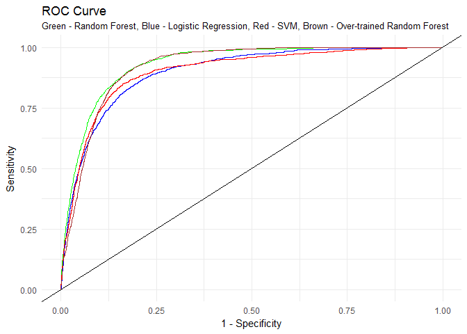
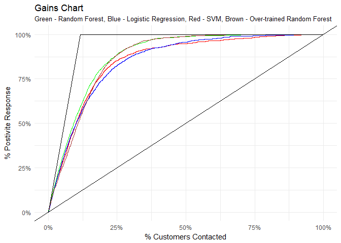

Classification Problem | Model selection by comparing Confusion Matrix, ROC, AUC and Gain Chart
================
Pulkit Sikri

``` r
bank <- read.csv("bank-full.csv",sep = ";")
```

Data Source: <https://archive.ics.uci.edu/ml/datasets/bank+marketing>

**The main purpose of this documentation is to Evaluate different models for binary classification and compare them using Confusion Matrix, ROC, AUC and Gain Chart and select the best model.**

Contents
--------

[1. Looking over the data](#looking-over-the-data)

[2. Evaluation of Models](#evaluation-of-models)
- [Random Forest](#random-forest)
- [Logistic Regression](#logistic-regression)
- [SVM Radial](#svm)
- [Random Forest on Over-Trained Data Set](#over-training-with-yes-and-using-randomforest)

[3. Comparing the models](#comparing-the-models)
- [ROC](#roc-curve)
- [AUC](#auc)
- [Gains Chart](#gains-chart)

[4.Final Note and Model Selection](#final-note-and-model-selection)

Looking over the data
=====================

``` r
#loading libraries
library(caTools)
library(caret)
library(e1071)
library(randomForest)
library(ROCR)
library(knitr)

str(bank)
```

    ## 'data.frame':    45211 obs. of  17 variables:
    ##  $ age      : int  58 44 33 47 33 35 28 42 58 43 ...
    ##  $ job      : Factor w/ 12 levels "admin.","blue-collar",..: 5 10 3 2 12 5 5 3 6 10 ...
    ##  $ marital  : Factor w/ 3 levels "divorced","married",..: 2 3 2 2 3 2 3 1 2 3 ...
    ##  $ education: Factor w/ 4 levels "primary","secondary",..: 3 2 2 4 4 3 3 3 1 2 ...
    ##  $ default  : Factor w/ 2 levels "no","yes": 1 1 1 1 1 1 1 2 1 1 ...
    ##  $ balance  : int  2143 29 2 1506 1 231 447 2 121 593 ...
    ##  $ housing  : Factor w/ 2 levels "no","yes": 2 2 2 2 1 2 2 2 2 2 ...
    ##  $ loan     : Factor w/ 2 levels "no","yes": 1 1 2 1 1 1 2 1 1 1 ...
    ##  $ contact  : Factor w/ 3 levels "cellular","telephone",..: 3 3 3 3 3 3 3 3 3 3 ...
    ##  $ day      : int  5 5 5 5 5 5 5 5 5 5 ...
    ##  $ month    : Factor w/ 12 levels "apr","aug","dec",..: 9 9 9 9 9 9 9 9 9 9 ...
    ##  $ duration : int  261 151 76 92 198 139 217 380 50 55 ...
    ##  $ campaign : int  1 1 1 1 1 1 1 1 1 1 ...
    ##  $ pdays    : int  -1 -1 -1 -1 -1 -1 -1 -1 -1 -1 ...
    ##  $ previous : int  0 0 0 0 0 0 0 0 0 0 ...
    ##  $ poutcome : Factor w/ 4 levels "failure","other",..: 4 4 4 4 4 4 4 4 4 4 ...
    ##  $ y        : Factor w/ 2 levels "no","yes": 1 1 1 1 1 1 1 1 1 1 ...

``` r
kable(head(bank))
```

|  age| job          | marital | education | default |  balance| housing | loan | contact |  day| month |  duration|  campaign|  pdays|  previous| poutcome | y   |
|----:|:-------------|:--------|:----------|:--------|--------:|:--------|:-----|:--------|----:|:------|---------:|---------:|------:|---------:|:---------|:----|
|   58| management   | married | tertiary  | no      |     2143| yes     | no   | unknown |    5| may   |       261|         1|     -1|         0| unknown  | no  |
|   44| technician   | single  | secondary | no      |       29| yes     | no   | unknown |    5| may   |       151|         1|     -1|         0| unknown  | no  |
|   33| entrepreneur | married | secondary | no      |        2| yes     | yes  | unknown |    5| may   |        76|         1|     -1|         0| unknown  | no  |
|   47| blue-collar  | married | unknown   | no      |     1506| yes     | no   | unknown |    5| may   |        92|         1|     -1|         0| unknown  | no  |
|   33| unknown      | single  | unknown   | no      |        1| no      | no   | unknown |    5| may   |       198|         1|     -1|         0| unknown  | no  |
|   35| management   | married | tertiary  | no      |      231| yes     | no   | unknown |    5| may   |       139|         1|     -1|         0| unknown  | no  |

The data is related with direct marketing campaigns of a Portuguese banking institution. The marketing campaigns were based on phone calls. Often, more than one contact to the same client was required, in order to access if the product (bank term deposit) would be ('yes') or not ('no') subscribed.

``` r
split <- sample.split(bank$y,SplitRatio = 0.70)
training_set <- subset(bank,split == T)
test_set <- subset(bank,split == F)
```

Evaluation of Models
====================

Random Forest
-------------

``` r
set.seed(10)
classifier1 = randomForest(y ~ age + job + marital + education + default + balance + housing + loan + contact + day + month + duration + campaign + pdays + previous + poutcome,
                          data = training_set)

y_pred_class1 <- predict(classifier1,test_set,type = "prob")

y_pred_class1 <- as.data.frame(y_pred_class1)
y_pred_1 <- ifelse(y_pred_class1$no > 0.5,"no","yes")
confusionMatrix(y_pred_1,test_set$y,positive = "yes")
```

    ## Confusion Matrix and Statistics
    ## 
    ##           Reference
    ## Prediction    no   yes
    ##        no  11514   793
    ##        yes   463   794
    ##                                           
    ##                Accuracy : 0.9074          
    ##                  95% CI : (0.9024, 0.9122)
    ##     No Information Rate : 0.883           
    ##     P-Value [Acc > NIR] : < 2.2e-16       
    ##                                           
    ##                   Kappa : 0.5074          
    ##  Mcnemar's Test P-Value : < 2.2e-16       
    ##                                           
    ##             Sensitivity : 0.50032         
    ##             Specificity : 0.96134         
    ##          Pos Pred Value : 0.63166         
    ##          Neg Pred Value : 0.93557         
    ##              Prevalence : 0.11700         
    ##          Detection Rate : 0.05854         
    ##    Detection Prevalence : 0.09267         
    ##       Balanced Accuracy : 0.73083         
    ##                                           
    ##        'Positive' Class : yes             
    ## 

``` r
perf1 <- performance(prediction(predictions = y_pred_class1[,2],
                                labels = test_set$y)
                     ,measure = "tpr", x.measure = "fpr")

gain1 <- performance(prediction(predictions = y_pred_class1[,2],
                                labels = test_set$y)
                     ,measure = "tpr", x.measure = "rpp")

auc1 <- performance(prediction(predictions = y_pred_class1[,2],
                                labels = test_set$y)
                     ,measure = "auc")
auc1 <- auc1@y.values[[1]]
```

Logistic Regression
-------------------

``` r
classifier2 = glm(y ~ age + job + marital + education + default + balance + housing + loan + contact + day + month + duration + campaign + pdays + previous + poutcome,
                          data = training_set,
                  family = binomial)

prob_pred = predict(classifier2, type = 'response', newdata = test_set)
y_pred_2 <- ifelse(prob_pred > 0.5,"yes","no")
confusionMatrix(y_pred_2,test_set$y,positive = "yes")
```

    ## Confusion Matrix and Statistics
    ## 
    ##           Reference
    ## Prediction    no   yes
    ##        no  11655  1026
    ##        yes   322   561
    ##                                           
    ##                Accuracy : 0.9006          
    ##                  95% CI : (0.8955, 0.9056)
    ##     No Information Rate : 0.883           
    ##     P-Value [Acc > NIR] : 3.61e-11        
    ##                                           
    ##                   Kappa : 0.4044          
    ##  Mcnemar's Test P-Value : < 2.2e-16       
    ##                                           
    ##             Sensitivity : 0.35350         
    ##             Specificity : 0.97312         
    ##          Pos Pred Value : 0.63533         
    ##          Neg Pred Value : 0.91909         
    ##              Prevalence : 0.11700         
    ##          Detection Rate : 0.04136         
    ##    Detection Prevalence : 0.06510         
    ##       Balanced Accuracy : 0.66331         
    ##                                           
    ##        'Positive' Class : yes             
    ## 

``` r
perf2 <- performance(prediction(predictions = prob_pred,
                                labels = test_set$y)
                     ,measure = "tpr", x.measure = "fpr")

gain2 <- performance(prediction(predictions = prob_pred,
                                labels = test_set$y)
                     ,measure = "tpr", x.measure = "rpp")

auc2 <- performance(prediction(predictions = prob_pred,
                                labels = test_set$y)
                     ,measure = "auc")

auc2 <- auc2@y.values[[1]]
```

SVM
---

``` r
classifier = svm(formula = y ~ age + job + marital + education + default + balance + housing + loan + contact + day + month + duration + campaign + pdays + previous + poutcome,
                 data = training_set,
                 type = 'C-classification',
                 kernel = 'radial',
                 probability = T)

y_pred_class3 <- predict(classifier,test_set,probability = T)
y_pred_class3 <- attr(y_pred_class3, "probabilities")
y_pred_class3 <- as.data.frame(y_pred_class3)
y_pred_3 <- ifelse(y_pred_class3$no > 0.5,"no","yes")
confusionMatrix(y_pred_3,test_set$y,positive = "yes")
```

    ## Confusion Matrix and Statistics
    ## 
    ##           Reference
    ## Prediction    no   yes
    ##        no  11687  1120
    ##        yes   290   467
    ##                                           
    ##                Accuracy : 0.896           
    ##                  95% CI : (0.8908, 0.9011)
    ##     No Information Rate : 0.883           
    ##     P-Value [Acc > NIR] : 8.29e-07        
    ##                                           
    ##                   Kappa : 0.3493          
    ##  Mcnemar's Test P-Value : < 2.2e-16       
    ##                                           
    ##             Sensitivity : 0.29427         
    ##             Specificity : 0.97579         
    ##          Pos Pred Value : 0.61691         
    ##          Neg Pred Value : 0.91255         
    ##              Prevalence : 0.11700         
    ##          Detection Rate : 0.03443         
    ##    Detection Prevalence : 0.05581         
    ##       Balanced Accuracy : 0.63503         
    ##                                           
    ##        'Positive' Class : yes             
    ## 

``` r
perf3 <- performance(prediction(predictions = y_pred_class3[,2],
                                labels = test_set$y)
                     ,measure = "tpr", x.measure = "fpr")


gain3 <- performance(prediction(predictions = y_pred_class3[,2],
                                labels = test_set$y)
                     ,measure = "tpr", x.measure = "rpp")


auc3 <- performance(prediction(predictions = y_pred_class3[,2],
                                labels = test_set$y)
                     ,measure = "auc")

auc3 <- auc3@y.values[[1]]
```

Over Training with Yes and using RandomForest
---------------------------------------------

**Since, in majority of the cases, the observations are classified as no. You would have observed the Sensitivity for each model is quite low, there now we will Over Train the models with observations that have yes as the outcome variable**

``` r
no_training_set <- training_set[training_set$y=="no",]
yes_training_set <- training_set[training_set$y=="yes",]

table(training_set$y)
```

    ## 
    ##    no   yes 
    ## 27945  3702

``` r
small_train_Set <- rbind(yes_training_set,head(no_training_set,25000))
small_train_Set <- rbind(small_train_Set,yes_training_set)


set.seed(10)
classifier4 = randomForest(y ~ age + job + marital + education + default + balance + housing + loan + contact + day + month + duration + campaign + pdays + previous + poutcome,
                          data = small_train_Set)


y_pred_class4 <- predict(classifier4,test_set,type = "prob")
y_pred_class4 <- as.data.frame(y_pred_class4)
y_pred_4 <- ifelse(y_pred_class4$no > 0.5,"no","yes")


perf4 <- performance(prediction(predictions = as.numeric(y_pred_class4[,2]),
                                labels = test_set$y)
                     ,measure = "tpr", x.measure = "fpr")

gain4 <- performance(prediction(predictions = as.numeric(y_pred_class4[,2]),
                                labels = test_set$y)
                     ,measure = "tpr", x.measure = "rpp")


auc4 <- performance(prediction(predictions = as.numeric(y_pred_class4[,2]),
                                labels = test_set$y)
                     ,measure = "auc")

auc4 <- auc4@y.values[[1]]

confusionMatrix(y_pred_4,test_set$y,positive = "yes")
```

    ## Confusion Matrix and Statistics
    ## 
    ##           Reference
    ## Prediction    no   yes
    ##        no  10842   449
    ##        yes  1135  1138
    ##                                           
    ##                Accuracy : 0.8832          
    ##                  95% CI : (0.8777, 0.8886)
    ##     No Information Rate : 0.883           
    ##     P-Value [Acc > NIR] : 0.4747          
    ##                                           
    ##                   Kappa : 0.5241          
    ##  Mcnemar's Test P-Value : <2e-16          
    ##                                           
    ##             Sensitivity : 0.7171          
    ##             Specificity : 0.9052          
    ##          Pos Pred Value : 0.5007          
    ##          Neg Pred Value : 0.9602          
    ##              Prevalence : 0.1170          
    ##          Detection Rate : 0.0839          
    ##    Detection Prevalence : 0.1676          
    ##       Balanced Accuracy : 0.8112          
    ##                                           
    ##        'Positive' Class : yes             
    ## 

**If you compare the confusion matrix of previous RandomForest model with the above Over - Trained Model you'll notice that even though the accuracy has decreased by around 2%, there is a massive jump is the Sensitivity from 41.95% to 71.582.**

*Let us further compare all the models using ROC curve, AUC and Gain Chart*

Comparing the models
====================

ROC Curve
---------

``` r
ggplot()+
  geom_line(aes(x=perf1@x.values[[1]],y=perf1@y.values[[1]]), col = "green")+
  geom_line(aes(x=perf2@x.values[[1]],y=perf2@y.values[[1]]), col = "blue")+
  geom_line(aes(x=perf3@x.values[[1]],y=perf3@y.values[[1]]),col = "red")+
  geom_line(aes(x=perf4@x.values[[1]],y=perf4@y.values[[1]]),col = "brown")+
  geom_abline(slope = 1,intercept = 0)+
  theme_minimal()+
  labs(title = "ROC Curve",subtitle = "Green - Random Forest, Blue - Logistic Regression, Red - SVM, Brown - Over-trained Random Forest",
       x = "1 - Specificity",
       y = "Sensitivity")
```



**From the above chart we infer that RandomForest on Normal data and RandomForest on Over-Trained Data are the best models among the lot.**

**We also see that in the initialstage for Over-Trained Data, the sacrifice of Specificty is highest amoung all the models, which is explainable as we have over trained our data for purpose of increasing Sensitivity only**

AUC
---

``` r
AUC <- matrix(c(auc1,auc2,auc3,auc4),ncol = 1)
AUC <- as.data.frame(cbind(c("RF","Logistic","SVM","RF_OVER"),AUC))
colnames(AUC) <- c("Model","Area Under Curve")
AUC
```

    ##      Model  Area Under Curve
    ## 1       RF 0.929814069699543
    ## 2 Logistic 0.898484803287386
    ## 3      SVM 0.899998574246922
    ## 4  RF_OVER 0.919869836636582

**We see that the AUC for Random Forest (Normal Data) is highest**

Gains Chart
-----------

``` r
ggplot()+
  geom_line(aes(x=gain3@x.values[[1]],y=gain3@y.values[[1]]),col = "red")+
  geom_line(aes(x=gain1@x.values[[1]],y=gain1@y.values[[1]]), col = "green")+
  geom_line(aes(x=gain2@x.values[[1]],y=gain2@y.values[[1]]), col = "blue")+
  geom_line(aes(x=gain4@x.values[[1]],y=gain4@y.values[[1]]), col = "brown")+
  geom_line(aes(x=c(0,0.1170009,1),y=c(0,1,1)),col = "black")+
  geom_abline(slope = 1,intercept = 0)+
  scale_x_continuous(labels =  paste0(as.character(seq(0,100,25)),"%"))+
  scale_y_continuous(labels =  paste0(as.character(seq(0,100,25)),"%"))+
  theme_minimal()+
  labs(title = "Gains Chart",subtitle = "Green - Random Forest, Blue - Logistic Regression, Red - SVM, Brown - Over-trained Random Forest",
       x = "% Customers Contacted",
       y = "% Postivite Response")
```



**From Gain chart also we observe that RandomForest on Normal data and RandomForest on Over-Trained Data are the best models among the lot.**

**The most important inference we can draw from this chart is that for both the RandomForest models even if we contact only 50% of the total Customers(top 50% based on prob of yes), we get a response rate close to 99%, and if we contact more than 20% of total Customers, it hardly matters which one of the two randomForest model we are using**

Final Note and Model Selection
==============================

**Looking at the confusion matrix and the Gain Chart, it is of my personal opinion that Over-trained Random Forest must be selected as it has a higher Sensitivity and if we contact more than 20% of total Customers, it hardly matters which one of the two randomForest model we are using**

Thank you!
